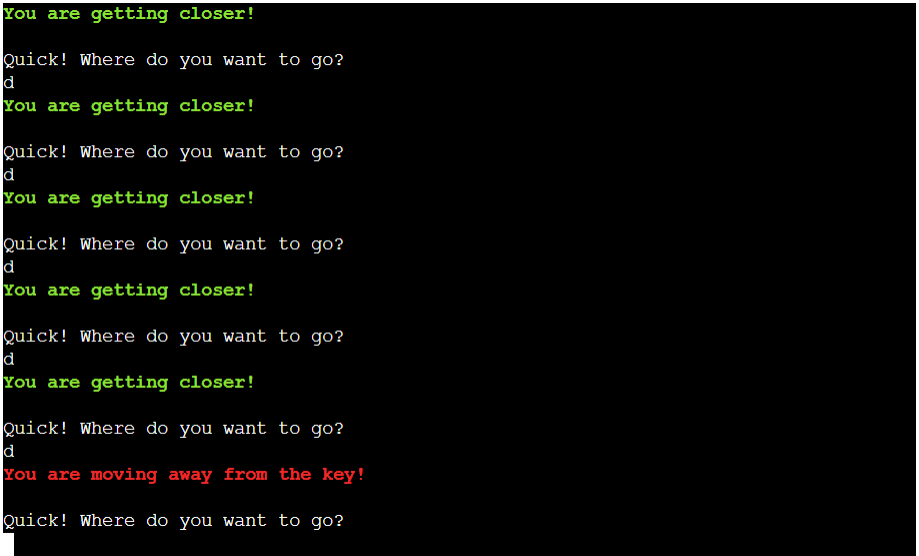
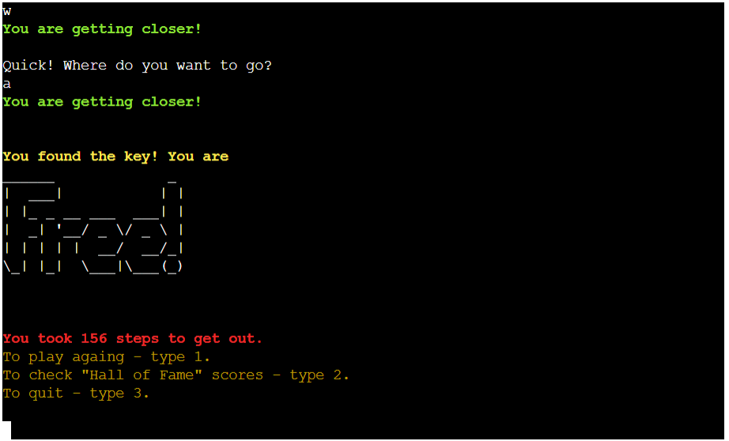

# Escape
Escape is a thrilling yet simple and intuitive terminal game testing users ability to folllow instructions to get out of a terrifying situation.

## Demo

Link to the live site here: <https://escape-pp3-e35bee694bd7.herokuapp.com/>

---

# Table of contents

* [User Experience (UX)](#user-experience-ux)

* [Design](#design)

* [Features](#features)

* [Testing](#testing)

* [Deployment](#deployment)

* [Solved Bugs](#solved-bugs)

* [Credits](#credits)
  
* [Acknowledgements](#acknowledgements)
  
---

## User Experience (UX)

### User goals

- Engaging game testing users ability to follow instructions.
- Intuitive interface.
- Accessibility to various devices.
- Users have an option of comparing their performance against other players.
 

### Company goals

- Providing entertainment.
- Fun, tongue in cheek plot and commentary.
- Suitable for users of various ages.
- Intuitive interface.
- Accessibility to various devices.
 
---

## Design

### Flowchart

The flowchart below demonstrates user interactions flow.

1. The player starts at the title page which offers a choice of difficulty levels.

2. The player is introduced to the predicament they have found themselves in and asked to input their name.

3. They are greeted and advised what to do.

4. The player is shown instructions on how to navigate the game including option of quitting and asked how do they want to proceed. 

5. Game continues until the objective is met. During the game the player is offered helpful hints.

6. Upon completing, the player is told that that they are free and informed how many steps it took them to complete the game.
The are offered a choice of playing again, visiting scoreboard or quitting.

7. From the scoreboard displaying top 10 results they can return to the choice again.

### Colour Scheme

Intuitive colour scheme was chosen to aid the player. It was created using Colorama library and a mixture of Fore, Back and Style methods.

* Red for warnings and prompts to correct input.

* Green for hints confirming correct direction.

* Yellow for instructions, options and highlights.

---

## Features

### Existing Features

The game starts with the title screen and smoothly leads the user along through the use of typing print effect, clearing screens and prompts for user input.

#### Title 

* Prominent tile created using Pyfiglet library and typing print effect. 
* Choice of difficulty levels.

#### Story 

* Short story line describing the situation and setting atmosphere.
* Name input.

#### Greeting

* Greeting.
* Information about the game objective.

#### Instructions

* Reiterated game objective.
* Instructions on navigation.
* Player is asked how do they want to proceed.

#### Game

* Player is continuosly asked how do they want to proceed until the game objective is met.
* Player is continuosly offered guiding hints.

#### End

* Player is informed that they have met the objective.
* Player is told how many steps they took to complete the game.
* End game options.

#### Hall of Fame

* Top 10 scores.
* Return to the menu option.

#### Obstacle

* Level 1 ad 2 contain randomly position obstacle, spider and fear respectively.
* If player encounters the obstacle the message is displayed and they are moved back to their starting point.

#### Wall

* Upon hitting any of the walls the player is prompted to change direction.

### Potential Future Updates and Features

* Separate scorebords for different levels of difficulty.

* Increased difficulty level by adding additional obstacles.

* Growing levels of difficulty as player progresses.

* Dedicated version for mobile devices.

---

## Testing

### Manual Testing 

#### Invalid input handling

Invalid input at any stage of the game is followed by the prompt to correct it. 

#### User Stories

| **Scenario** | **Action**                  | **Result** |                           
| ----------- | --------------------------- | ---------- |
| User wants to input their name | User is asked to input their name | User is addressed by their name | 
| User wants to read the instructions | Set of instructions appears before the user is asked how they want to proceed | Instructions are accessible |
| User has trouble locating key | User is given hints in which direction to proceed | Hints are working as expected |
| User wants to see scoreboard | At the end of game user is offered a choice to see the scoreboard | Scoreboard is accessible | 
| User wants to quit the game | Instructions contain the directions how to quit the game | User has option of quitting the game |

### Code Institute Python Linter

### Accessibility

* Intuitive interface.
* Intuitive colour choices.
* Accessible on various devices.

---

## Deployment 

### Deployment

The game was created using VS Code and deployed using Code Institute mock terminal for Heroku:

1. Log in to Heroku.
2. Create a new Heroku app.
3. Select buildpacks to Python and NodeJS in that order.
5. In Heroku's settings, add a config var of PORT and set the value to 8000.
6. Select deploy method and search for repository.
7. Deploy.

Forking

1. Log in to GitHub and locate the GitHub Repository
2. In the top-right corner of the page, click Fork.
3. Once clicked, you should have a copy of the repository.

Cloning

1. On GitHub.com, navigate to your fork of the repository.
2. Above the list of files, click Code.
3. Select if you prefer to clone using HTTPS, SSH, or GitHub CLI and click the copy button to copy the URL to your clipboard.
4. Open Git Bash.
5. Change the current working directory to the location where you want the cloned directory.
6. Type git clone, and then paste the URL you copied earlier.
7. Press Enter to create your clone.

## Solved Bugs

1. User name not capitalized in scorechart.
    * Added capitalization to the function updating score.
2. Background colour spilling over on the line below.
    * Removed /n from the coloured line.
3. Clear function 'cls' not working after deployment to Heroku.
    * Fixed by adding 'clear'option to the function - solution found on (https://stackoverflow.com/).
4. After deployment to Heroku quit function became irrelevant as due to the nature of the project terminal it was not quitting the program.
    * As advised by the mentor I have opted to use it to bring the player back to the title screen.
   
---

## Credits

### Technologies Used

* [VSCode](https://code.visualstudio.com/)

* [Git](https://git-scm.com/)
    
* [GitHub](https://github.com/)
   
* [Heroku](https://id.heroku.com)
  
* [Mockup Screenshot Generator](https://ui.dev/amiresponsive)

* [Diagrams maker](https://app.diagrams.net/)

* [Code Institute Python Linter](https://pep8ci.herokuapp.com/)

### Reference Material

* [Love Sandwiches Walkthrough project](https://learn.codeinstitute.net/ci_program/diplomainsoftwaredevelopmentecomm)

* [W3 School](https://www.w3schools.com)

* [Stackoverflow](https://stackoverflow.com/)

* [Python Tutor](https://pythontutor.com/python-compiler.html#mode=edit)

* [Match case statement](https://learnpython.com/blog/python-match-case-statement/)

* [Typing text effects](https://www.101computing.net/python-typing-text-effect/)
   
* [Use of colorama](https://www.codu.co/articles/adding-colour-to-python-code-lbai_0u7)

---

## Acknowledgements

* Mentor and Tutor suport at Code Institute.
* Code Institute team for creating mock terminal.

 

